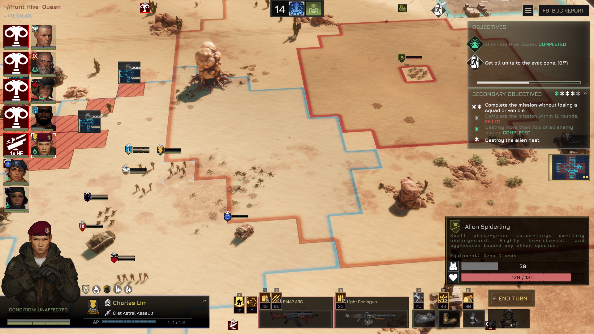
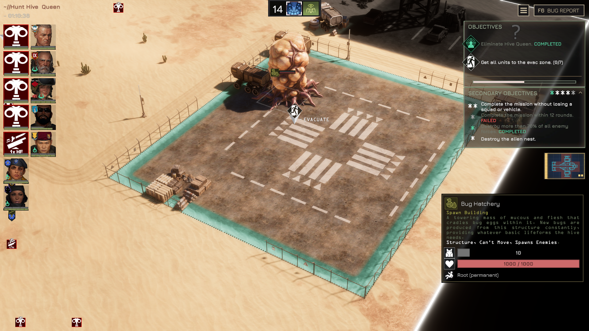
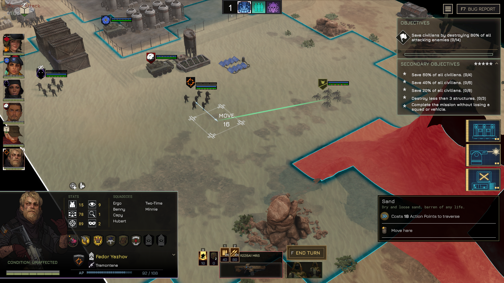
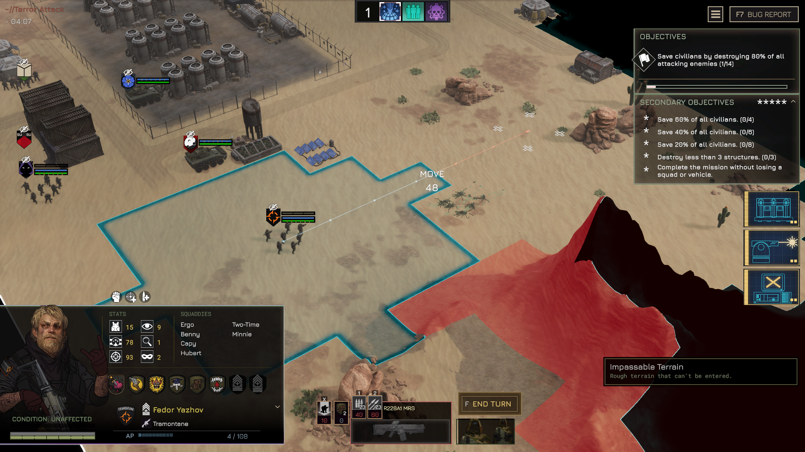
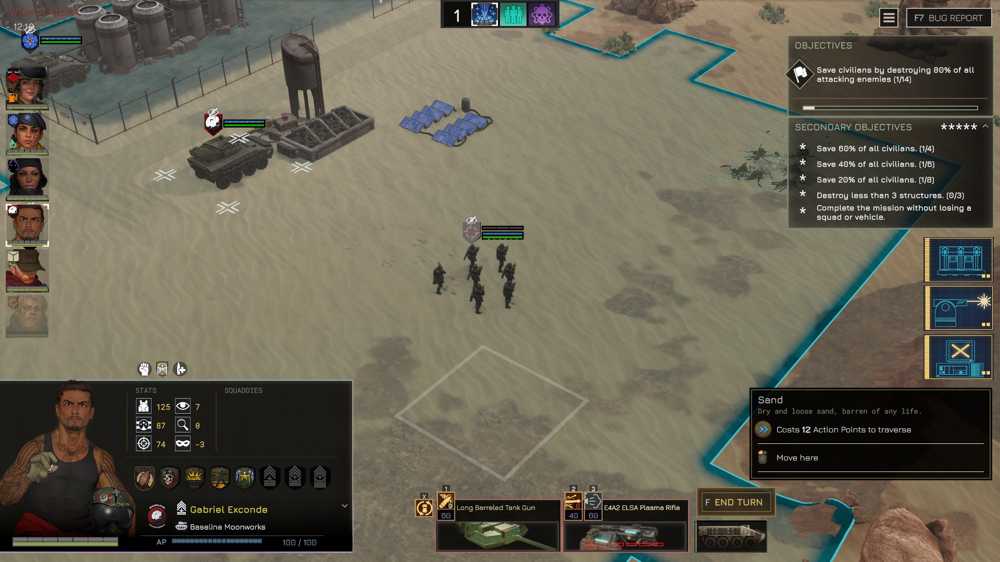
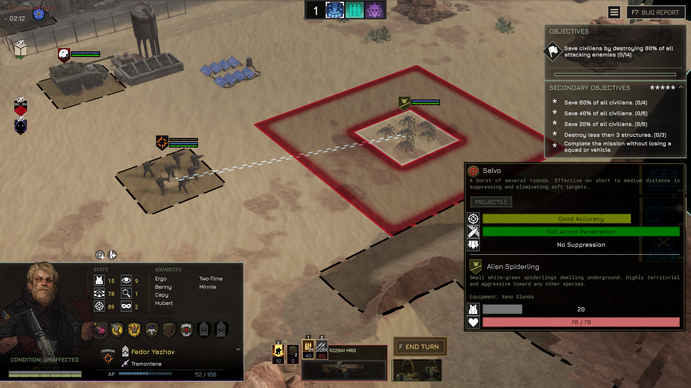
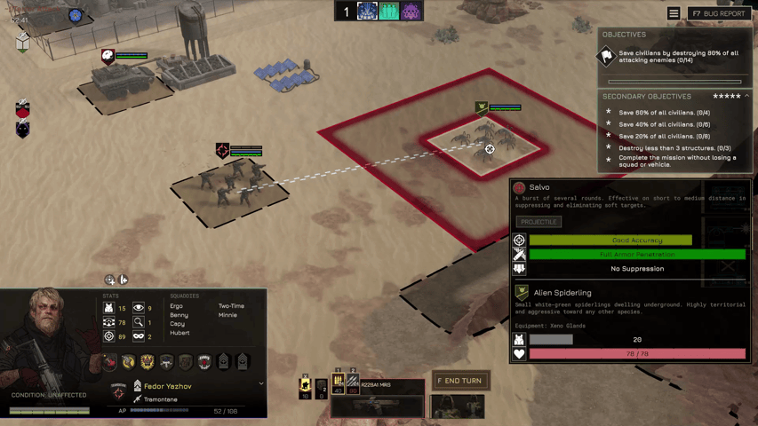
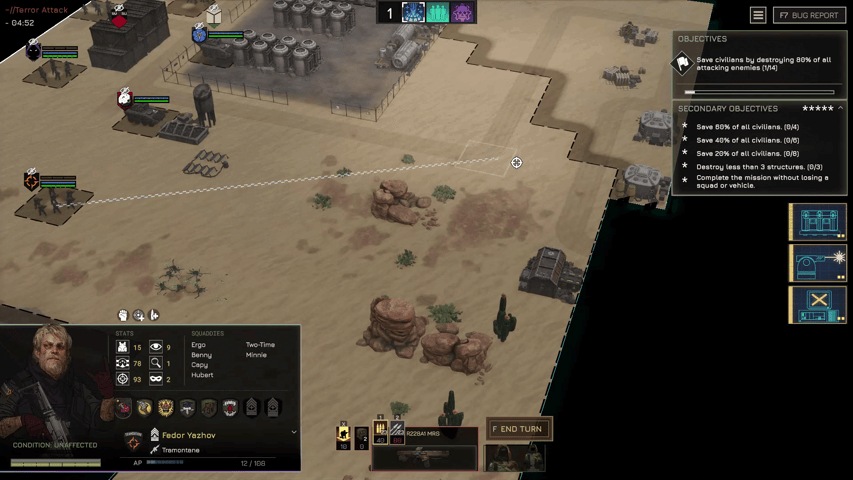

# HUDCustomizer

A mod for **MENACE** that lets you change the appearance of the tactical HUD — colours, fonts, and scaling — without editing game files. All settings are stored in a single text file that you can edit in Notepad, and changes can be applied in-game without restarting.












---

## Requirements

- MelonLoader
- Menace Modpack Loader

---

## Installation

1. Click the `+Add Mod` button in the Menace Modkit and select the `HUDCustomizer_1_x_x.zip` file.

2. Click the `Deploy to Game` button in the Menace Modkit.

3. Launch the game. On first run, the mod creates the config file automatically:
   - `Menace/Mods/HUDCustomizer/HUDCustomizer.json`
   - If you have downloaded the optional HUDCustomizer.json file from Nexusmods with my personal config preset, place the file in the same directory as above.

4. Open that file in any text editor to start customising.
   - Sublime is my lightweight text editor of choice. Notepad++ is no longer a trusted source.

> **Note:** Each time the config loads successfully, the mod saves a backup copy to `Menace/UserData/HUDCustomizer/HUDCustomizer.json`. If you uninstall and reinstall the mod, your settings are automatically restored from this backup on next launch.

---

## How to use

New to the mod? See the **[Getting Started guide](GETTING_STARTED.md)** for the highest-impact settings to configure first.

Open `HUDCustomizer.json` in a text editor. Every setting has a comment above or beside it explaining what it does and what the game's original value is. Change the values you want, save the file, then apply your changes in-game.

### Applying changes without restarting

Press **F8** while in a tactical mission to reload the config instantly. The key is configurable — see `ReloadKey` at the bottom of the config file.

Hot-reload only works during a tactical mission. Changes to tile highlights, fonts, colours (including USS theme colours, rarity colours, and faction health bar colours), scaling, visualizer settings, and spent unit opacity all apply immediately when you press the key. You do not need to restart the game or reload the mission.

USS theme colours (`USSColors` section) are also applied automatically each time the strategy map loads — you do not need to press the reload key to see them there.

---

## What you can change

### HUD scale

Controls how large the floating HUD elements above each unit appear.

- **UnitHUDScale** — scales infantry and soldier HUDs. `1.0` is the original size, `1.5` is 50% larger, `0.8` is 20% smaller.
- **EntityHUDScale** — scales vehicle, emplacement, and other non-infantry HUDs separately.
- **StructureHUDScale** — scales structure HUDs independently from entity and unit HUDs.
- **TransformOriginX / TransformOriginY** — controls which point of the HUD stays in place as you scale it. At the defaults, HUDs grow upward from their base — increasing the scale makes the bar taller without pushing it down into the unit below. `X: 50` is horizontal centre. `Y: 100` pins the bottom edge, `Y: 0` pins the top edge, `Y: 50` pins the middle.
- **SpentUnitHUDOpacity** — controls how transparent a unit's HUD becomes after it has used its turn. The game default is `0.5` (50% opacity, visibly dimmed). Set to `1.0` to keep spent units fully visible, or `0.0` to make them invisible. Set to `-1` to leave the game default unchanged.

### Unit and entity HUD bar colours

Controls the colours of the health, armour, and suppression bars shown above each unit, as well as the unit badge tint.

Each bar has three colour slots:

- **Fill** — the filled portion of the bar representing the current value.
- **Preview** — a lighter highlight shown briefly when the value changes.
- **Track** — the background of the bar (visible where the bar is empty).

Set any value to `""` (two quote marks with nothing between them) to leave it unchanged and use the game default.

**Game defaults for reference:**

| Element | Default colour |
|---|---|
| Hitpoints fill | 145, 156, 100 (olive green) |
| Hitpoints preview | 186, 226, 105 (light green) |
| Hitpoints track | 0, 0, 0, 0.33 (dark, semi-transparent) |
| Armour fill | 116, 116, 116 (mid grey) |
| Armour preview | 89, 89, 89 (dark grey) |
| Armour track | 0, 0, 0, 0.33 (dark, semi-transparent) |
| Suppression fill | 205, 183, 107 (tan) |
| Suppression preview | 243, 217, 127 (light tan) |
| Suppression track | 51, 51, 51, 0.70 (dark, semi-transparent) |
| Badge tint | 255, 255, 255 (white = no tint) |

### Faction health bar colours

Controls the health bar colours shown in the **unit info panel** when you select a unit — the panel that appears on screen when you click on a soldier or vehicle. This is separate from the floating bars above units.

There are separate colours for player units, allies, and enemies, plus section colours that mark armour segments on the bar.

Each slot uses the `{ "Enabled": false, "R": ..., "G": ..., "B": ..., "A": ... }` format. Set `"Enabled": true` to activate the override for that slot.

**Game defaults for reference:**

| Element | Default colour |
|---|---|
| Player units fill | 145, 156, 100 (olive green) |
| Player units preview | 186, 226, 105 (light green) |
| Allies fill | 138, 151, 161 (blue grey) |
| Allies preview | 184, 199, 211 (light blue grey) |
| Enemies fill | 204, 104, 106 (red) |
| Enemies preview | 240, 75, 75 (bright red) |
| Player section colour | 95, 114, 35 (dark green) |
| Enemy section colour | 172, 44, 45 (dark red) |

### Fonts

Controls the font and size used for text elements across the tactical HUD.

- **Global** — applied to all text elements first. Set a font or size here and it affects everything unless overridden by a more specific entry below.
- Per-element entries (**UnitBarLabel**, **ObjTrackerHeadline**, etc.) — override the Global setting for that specific element. Leave `Font` as `""` or `Size` as `0` to use the Global value for that element.

**Available fonts** (these are the only valid names):

| Font name | Style |
|---|---|
| `Jura-Regular` | Clean, geometric — the game's default UI font |
| `Jura-Bold` | Bold weight of Jura |
| `OCRAStd` | Monospace, technical feel |
| `Inconsolata-SemiBold` | Monospace, slightly lighter |
| `NotInter-Regular` | Neutral sans-serif |
| `NotoSansJP-Regular` | Japanese script support |
| `NotoSansKR-Regular` | Korean script support |
| `NotoSansSC-Regular` | Simplified Chinese support |
| `NotoSansTC-Regular` | Traditional Chinese support |

Using any name not on this list will have no effect and will log a warning.

**Text elements you can target:**

| Config entry | What it affects | Default size |
|---|---|---|
| `Global` | All HUD text (overridden by entries below) | — |
| `UnitBarLabel` | Bar value labels on unit and entity HUDs | 14 |
| `ObjTrackerHeadline` | "Objectives" section heading | 12 |
| `ObjTrackerPoints` | Point value on each objective | 16 |
| `ObjTrackerDescription` | Objective description text | 10 |
| `ObjTrackerLabel` | Progress bar labels in the tracker | 14 |
| `ObjSecondaryHeadline` | "Secondary Objectives" heading | 12 |
| `ObjRewardPoints` | Reward point total in the tracker | 16 |
| `MissionName` | Mission title shown during play | 12 |
| `MissionDuration` | Mission timer | 12 |
| `ObjectiveNameLabel` | Objective name on the floating objective HUD | 13 |
| `ObjectiveStateLabel` | Objective status text on the floating HUD | 14 |
| `MovementCostLabel` | AP cost shown when selecting movement | 16 |
| `MovementActionLabel` | Action type label when selecting movement | 14 |
| `BleedingIconText` | Text on bleeding/damage floating icons | — |
| `DropdownText` | Flyover text shown above units (AP changes, skill results, suppression) | 14 |
| `SkillBarActionPointsLabel` | Skill bar action point cost label | — |
| `SkillBarUsesLabel` | Skill bar uses label | — |
| `SkillBarHotkeyLabel` | Skill bar hotkey label | — |
| `SimpleSkillBarLabel` | Simple skill bar text label | — |
| `SimpleSkillBarHotkeyLabel` | Simple skill bar hotkey label | — |
| `SkillBarSlotWeaponNameLabel` | Weapon slot name label | — |
| `SelectedUnitConditionLabel` | Selected unit condition label | — |
| `SelectedUnitActionPointsLabel` | Selected unit AP label | — |
| `TacticalUnitInfoValueLabel` | Selected unit stat value label | — |
| `TurnOrderPanelRoundNumberLabel` | Turn order round number label | — |
| `StatusEffectIconStackCountLabel` | Status effect stack count label | — |

Each entry takes three values:

```json
"MissionName": { "Font": "", "Size": 0, "Color": "" }
```

- `Font` — font name from the list above, or `""` to leave unchanged.
- `Size` — font size as a number, or `0` to leave unchanged.
- `Color` — colour in `"R, G, B"` or `"R, G, B, A"` format, or `""` to leave unchanged.

### Tactical UI element styles

Two additional config sections control tint and style overrides for tactical UI elements.

#### Objectives tracker progress bar (`ObjectivesTrackerProgressBar`)

Controls the fill, preview, and track colours of the progress bar in the objectives tracker panel. Uses the same string format as the unit HUD bar colours:

- `FillColor` — the filled portion of the bar
- `PreviewColor` — the brief highlight shown when the value changes
- `TrackColor` — the bar background (visible where the bar is empty)

Set any value to `""` to leave it unchanged.

#### Tactical element tints (`TacticalUIStyles`)

Controls image tints on specific tactical UI elements. Each tint slot uses the `{ "Enabled": false, "R": ..., "G": ..., "B": ..., "A": ... }` format — the same as tile highlights. Set `"Enabled": true` to apply.

Tints are multiplicative: white (`255, 255, 255`) leaves the original image unchanged. Other colours shift the hue or darken the image.

| Section | Element | Tint slots |
|---|---|---|
| `SkillBarButton` | Skill slot buttons in the skill bar | `SkillIconTint` — skill icon image<br>`SelectedOverlayTint` — overlay when skill is active/selected<br>`HoverOverlayTint` — overlay on mouse hover |
| `SkillBarButton` | — | `PreviewOpacity` — opacity of the button during preview state. Float: `0.0` (invisible) to `1.0` (fully opaque). `-1` = leave unchanged. |
| `BaseSkillBarItemSlot` | Equipment slots in the skill bar (weapon and accessory) | `BackgroundTint` — slot background<br>`ItemIconTint` — equipped item icon<br>`CrossTint` — X overlay shown when the slot is unusable |
| `SimpleSkillBarButton` | Simple action buttons (e.g. overwatch, wait) | `HoverTint` — overlay on mouse hover |
| `TurnOrderFactionSlot` | Faction icons in the turn order panel | `InactiveMaskTint` — overlay when the faction has no remaining turns<br>`SelectedTint` — highlight on the active faction<br>`InactiveIconTint` — faction icon when inactive |
| `UnitsTurnBarSlot` | Unit portrait slots in the turn order bar | `OverlayTint` — animated overlay (game default: grey)<br>`SelectedTint` — highlight on the selected unit's slot<br>`PortraitTint` — unit portrait image |
| `SelectedUnitPanel` | Unit info panel shown when a unit is selected | `PortraitTint` — unit portrait image<br>`HeaderTint` — header background |
| `TacticalUnitInfoStat` | Individual stat rows in the selected unit panel | `IconTint` — stat icon |
| `DelayedAbilityHUD` | HUD element for delayed off-map abilities | `ProgressTint` — progress ring/bar fill |

### Tile highlight colours

Controls the coloured overlays shown on tiles during tactical play — movement range, skill range, AoE areas, enemy view cones, fog of war, and so on.

Each slot uses the `{ "Enabled": false, "R": ..., "G": ..., "B": ..., "A": ... }` format:

- Set `"Enabled": true` to activate your colour for that slot.
- Set `"Enabled": false` to leave that slot at the game default.
- `R`, `G`, `B` are 0–255 integers.
- `A` is opacity from `0.0` (fully transparent) to `1.0` (fully opaque).

**Available slots:**

| Slot name | What it colours |
|---|---|
| `FowOutlineColor` | Fog of war tile outline |
| `FowOutlineInnerGlowColor` | Inner glow on fog of war outline |
| `FowUnwalkableColor` | Unwalkable tiles within fog of war |
| `ObjectiveColor` | Objective tile highlight |
| `ObjectiveGlowColor` | Glow on objective tiles |
| `SkillRangeColor` | Skill range overlay |
| `SkillRangeGlowColor` | Glow on skill range tiles |
| `AoEFillColor` | Area of effect fill |
| `AoELineColor` | Area of effect outline |
| `SpecialAoETileColor` | Special AoE tile variant |
| `DelayedAoEFillColor` | Delayed AoE fill |
| `DelayedAoEOutlineColor` | Delayed AoE outline |
| `DelayedAoEInnerLineColor` | Delayed AoE inner line |
| `EnemyViewColor` | Enemy view cone tiles |
| `EnemyViewGlowColor` | Glow on enemy view tiles |
| `EnemySkillsColor` | Enemy skill range tiles |
| `EnemySkillsGlowColor` | Glow on enemy skill range |
| `EnemySkillsTintColor` | Tint on enemy skill tiles |
| `MovementColor` | Player movement range |
| `MovementGlowColor` | Glow on movement range |
| `MovementTintColor` | Tint on movement tiles |
| `UnwalkableColor` | Unwalkable tile highlight |
| `UnplayableOutlineColor` | Unplayable area outline |

### USS global theme colours

Controls the core colour palette used across the entire game UI — not just the tactical HUD. Changes here affect menus, tooltips, buttons, and panels on every screen.

> **Important:** Because these colours apply everywhere, changing something like `ColorInteract` will affect button colours throughout the entire game, not just in combat. Test carefully.

Each slot uses the same `{ "Enabled": false, "R": ..., "G": ..., "B": ..., "A": ... }` format as tile highlights.

**Game defaults for reference:**

| Slot | Purpose | Default (RGB) |
|---|---|---|
| `ColorNormal` | Standard text colour | 225, 225, 225 |
| `ColorBright` | Highlighted/accent text | 255, 214, 127 |
| `ColorNormalTransparent` | Subtle text | 225, 225, 225, A=0.07 |
| `ColorInteract` | Interactive element colour | 187, 175, 149 |
| `ColorInteractDark` | Darker interactive variant | 122, 115, 98 |
| `ColorInteractHover` | Hover state | 238, 226, 189 |
| `ColorInteractSelected` | Selected state | 215, 192, 116 |
| `ColorInteractSelectedText` | Text on selected elements | 0, 0, 0 |
| `ColorDisabled` | Disabled element colour | 72, 72, 72 |
| `ColorDisabledHover` | Disabled hover state | 199, 199, 199 |
| `ColorTooltipBetter` | Tooltip "better than current" comparison | 0, 184, 0 |
| `ColorTooltipWorse` | Tooltip "worse than current" comparison | 229, 0, 0 |
| `ColorTooltipNormal` | Tooltip neutral text | 225, 225, 225 |
| `ColorPositive` | Positive status indicators | 72, 191, 147 |
| `ColorNegative` | Negative status indicators | 180, 67, 65 |
| `ColorWarning` | Warning indicators | 255, 50, 50 |
| `ColorDarkBg` | Dark background panels | 22, 25, 24 |
| `ColorWindowCorner` | Window corner decoration | 233, 212, 111 |
| `ColorTopBar` | Top bar elements | 225, 225, 225 |
| `ColorTopBarDark` | Dark top bar variant | 160, 171, 163 |
| `ColorProgressBarNormal` | Progress bar fill | 225, 225, 225 |
| `ColorProgressBarBright` | Progress bar bright variant | 232, 205, 124 |
| `ColorEmptySlotIcon` | Empty equipment slot icons | 65, 86, 90 |
| `ColorMissionPlayable` | Campaign map — available mission node | 168, 152, 103 |
| `ColorMissionLocked` | Campaign map — locked mission node | 168, 152, 103 |
| `ColorMissionPlayed` | Campaign map — completed mission node | 113, 102, 69 |
| `ColorMissionPlayedArrow` | Campaign map — arrow on completed node | 75, 67, 44, A=0.50 |
| `ColorMissionUnplayable` | Campaign map — unplayable mission node | 115, 115, 115 |

### Rarity and item colours

Controls the colours used to display item and unit rarity throughout the UI — in tooltips, the loadout screen, and anywhere rarity is indicated.

These are stored under `"RarityColors"` in the config. Each slot uses the `{ "Enabled": false, "R": ..., "G": ..., "B": ..., "A": ... }` format. Set `"Enabled": true` to activate the override for that slot.

| Slot | What it colours | Default (RGB) |
|---|---|---|
| `Common` | Common rarity label / border | 116, 108, 75 |
| `CommonNamed` | Named common item label | 216, 232, 203 |
| `Uncommon` | Uncommon rarity label / border | 61, 117, 136 |
| `UncommonNamed` | Named uncommon item label | 185, 208, 214 |
| `Rare` | Rare rarity label / border | 189, 49, 49 |
| `RareNamed` | Named rare item label | 252, 241, 240 |
| `ColorPositionMarkerDelayedAbility` | World-space marker for delayed off-map abilities | 0, 255, 255 |

### Tactical visualizer colours

Controls the colours and parameters of the 3D visualizers drawn in the world during tactical play.

Each colour slot uses the `{ "Enabled": false, "R": ..., "G": ..., "B": ..., "A": ... }` format. Set `"Enabled": true` to activate the override for that slot.

#### Movement path (`MovementVisualizer`)

Controls the line drawn on the ground when you plan a unit's movement.

| Slot | What it colours |
|---|---|
| `ReachableColor` | Path segments within the unit's action point range |
| `UnreachableColor` | Path segments that exceed the unit's remaining action points |

#### Aim line (`TargetAimVisualizer`)

Controls the animated arc drawn from your unit to a target when selecting a skill.

| Slot / Parameter | What it controls |
|---|---|
| `InRangeColor` | Base tint of the line texture. Default: white (no tint) |
| `InRangeEmissiveColor` | Hue of the bloom/glow effect. Default: white |
| `EmissiveIntensity` | Brightness of the bloom. Game default is ~15, which produces a strong glow. Set to `0` to remove bloom entirely. Use `-1` to leave unchanged |
| `OutOfRangeColor` | Colour of the line when the target is out of range |
| `AnimationScrollSpeed` | How fast the texture animates along the line. Use `-1` to leave unchanged |
| `Width` | World-space width of the line in metres. Use `-1` to leave unchanged |
| `MinimumHeight` | Minimum arc height above terrain. Use `-1` to leave unchanged |
| `MaximumHeight` | Maximum arc height above terrain. Use `-1` to leave unchanged |
| `DistanceToHeightScale` | How much the arc height increases with target distance. Use `-1` to leave unchanged |

> **Tip:** To tint the aim line a colour, set `InRangeColor` to your desired hue. If the bloom washes it out, reduce `EmissiveIntensity` (try values between `1` and `5`). To also tint the glow, set `InRangeEmissiveColor` to the same or a complementary colour.

#### Line of sight (`LineOfSightVisualizer`)

Controls the colour of the line-of-sight rays drawn from your units during targeting.

| Slot | What it colours |
|---|---|
| `LineColor` | All LOS line segments |

Each LOS ray is rendered as three segments — a fade-in at the start, a solid middle section, and a fade-out at the end. The `LineColor` setting controls the RGB and peak opacity of all three; the fade at each end is applied automatically to match the game's visual style.

> **Tip:** The LOS lines are brief and subtle at default white. Setting a bright or saturated colour makes them much easier to read at a glance.

### Combat flyover text

Displays combat results as flyover text above the attacking unit after each skill use — showing HP damage dealt, armour damage, and accuracy. This feature is built into HUDCustomizer and enabled by default.

Settings are grouped under `"CombatFlyover"` in the config file.

#### Enable / disable

The feature is enabled by default. Set `"Enabled": false` to turn off all flyovers entirely. This takes effect immediately on hot-reload without restarting the game.

#### Flyover colours

Each flyover type has its own colour, set as a hex string. Unity only supports the following colour formats — other formats will render as white or be silently ignored:

- `#RRGGBB` — six-digit hex, e.g. `"#FF4444"`
- `#RRGGBBAA` — eight-digit hex with alpha, e.g. `"#FF4444FF"`
- A limited set of named colours: `aqua`, `black`, `blue`, `brown`, `cyan`, `darkblue`, `fuchsia`, `green`, `grey`, `lightblue`, `lime`, `magenta`, `maroon`, `navy`, `olive`, `orange`, `purple`, `red`, `silver`, `teal`, `white`, `yellow`

| Setting | What it colours | Default |
|---|---|---|
| `ColourHPDamage` | HP damage flyover (e.g. `-24 HP`) | `#FF4444` (red) |
| `ColourArmourDamage` | Armour damage flyover (e.g. `-33 ARM`) | `#4488FF` (blue) |
| `ColourAccuracy` | Accuracy flyovers (e.g. `~65%` and `75%`) | `#44CC44` (green) |

#### Display duration

Controls how long each flyover is visible and how it fades.

| Setting | What it controls | Default |
|---|---|---|
| `ExtraDisplaySeconds` | Additional seconds added to the game's default 1.5s display window. Set to `0` to use the game default | `2.0` |
| `FadeDurationScale` | Multiplier applied to the game's default 1500ms fade animation. `1.0` = game default fade speed, `2.0` = twice as slow | `2.0` |

At the defaults, each flyover is visible for **5 seconds** total: 3 seconds of fade-out over a 2-second extended display window.

Because flyovers display one at a time in sequence, the total time to see all flyovers from a single attack equals 5 seconds × number of flyovers. A typical attack produces three or four flyovers (theoretical accuracy, HP damage, armour damage, actual accuracy).

---

## Troubleshooting

**My changes aren't doing anything.**

- Make sure you saved the file after editing.
- Press F8 in a tactical mission to reload. Changes only take effect after a reload.
- Check that the values are in the correct format. Bar colours use the string format (`"145, 156, 100"`). Tile, USS, and visualizer colours use the object format with an `Enabled` field — make sure `"Enabled"` is set to `true`, not `false`.
- If a font setting isn't working, check that the font name is spelled exactly as shown in the font list above, including capitalisation and hyphens.

**The aim line colour change isn't working.**

The aim line uses an HDRP Unlit shader with a strong bloom effect. If you set `InRangeColor` but see no change, the bloom may be overpowering it. Try reducing `EmissiveIntensity` to a value between `1` and `5` at the same time.

**The game showed an error about the config file.**

If the file is saved with a syntax error (a missing comma, unclosed bracket, etc.), the mod will log the exact line and column number of the problem and continue running with default settings for that session. Your file is not modified — open it in a text editor, go to the line shown in the log, fix the error, save, and press the reload key to apply your settings without restarting the game.

**I can't find my config file.**

It is created the first time you launch the game with the mod installed, at:
```
Menace/Mods/HUDCustomizer/HUDCustomizer.json
```

**Pressing F8 isn't working.**

Hot-reload only works while in a tactical mission, not in menus or the strategy layer. If you want to use a different key, change the `ReloadKey` value at the bottom of the config file. Use standard key names: `F1`–`F12`, `Alpha1`–`Alpha9`, `Keypad0`–`Keypad9`, etc.

**A bar colour change worked on most units but not all.**

There are actually two separate health bar systems. The floating bars above units on the battlefield and the health bar inside the info panel shown when you click a unit are controlled by different settings. If you only changed one, the other will still show the original colour. To make everything consistent, you need to set both — the floating bar colours under "Unit and entity HUD bar colours" and the panel bar colours under "Faction health bar colours".

**I uninstalled and reinstalled the mod and my settings are gone.**

If the mod was uninstalled via the Menace Mod Kit, the `Mods/HUDCustomizer/` folder may have been removed. Your settings are preserved in the UserData backup at:
```
Menace/UserData/HUDCustomizer/HUDCustomizer.json
```
Simply reinstall the mod and launch the game — the mod will detect the missing config and restore it from the backup automatically. A log message will confirm the restore occurred.

**I want to go back to the game defaults.**

Set string values back to `""` and object values back to `"Enabled": false`. Float visualizer parameters can be set back to `-1`. You can also delete `HUDCustomizer.json` entirely and restart the game — a fresh default config will be generated automatically.

**The combat flyover text isn't appearing.**

Check that `"Enabled"` is set to `true` in the `CombatFlyover` section of the config and that you have hot-reloaded with F8. Note that flyovers only appear on the attacking unit's HUD — if the attacker is killed before the skill resolves, flyovers for that attack will not display.

**The flyover colours aren't changing after a hot-reload.**

Colour changes apply to flyovers that fire after the reload — any flyover already in the queue when you pressed F8 will display with the old colour. Trigger another attack and the new colours will appear.

---

## Notes

- `DebugLogging` can be set to `true` to write detailed per-element logs to the MelonLoader log file. This is useful for diagnosing why a setting isn't applying, but generates a lot of output. Leave it `false` in normal use.
- All settings are optional. Any setting left at its default value has no effect on the game.
